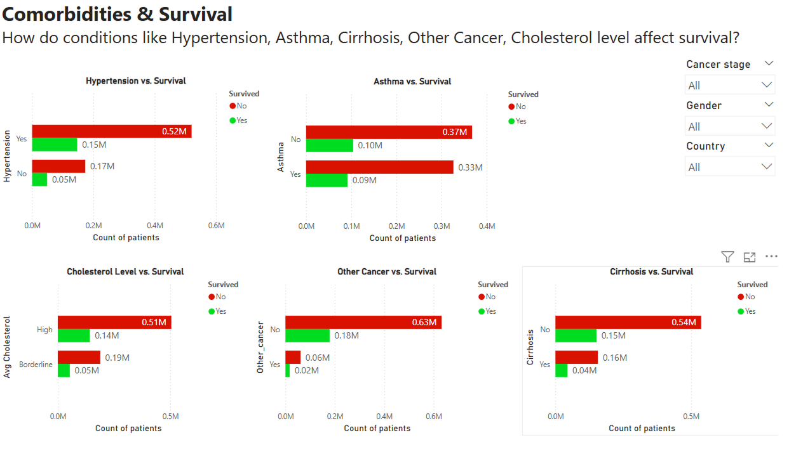
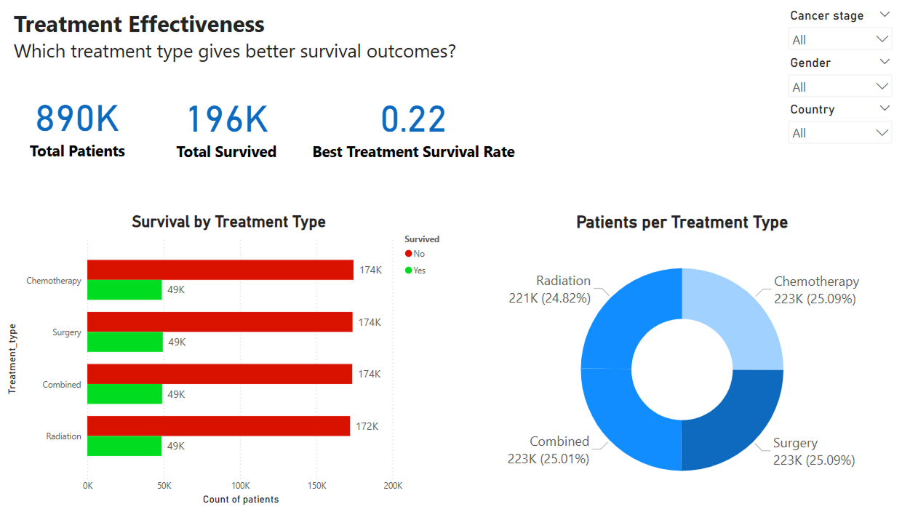
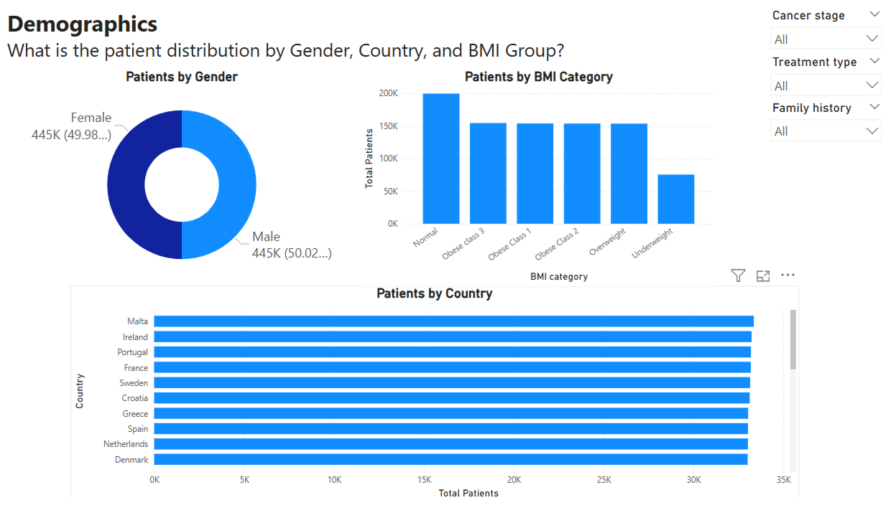
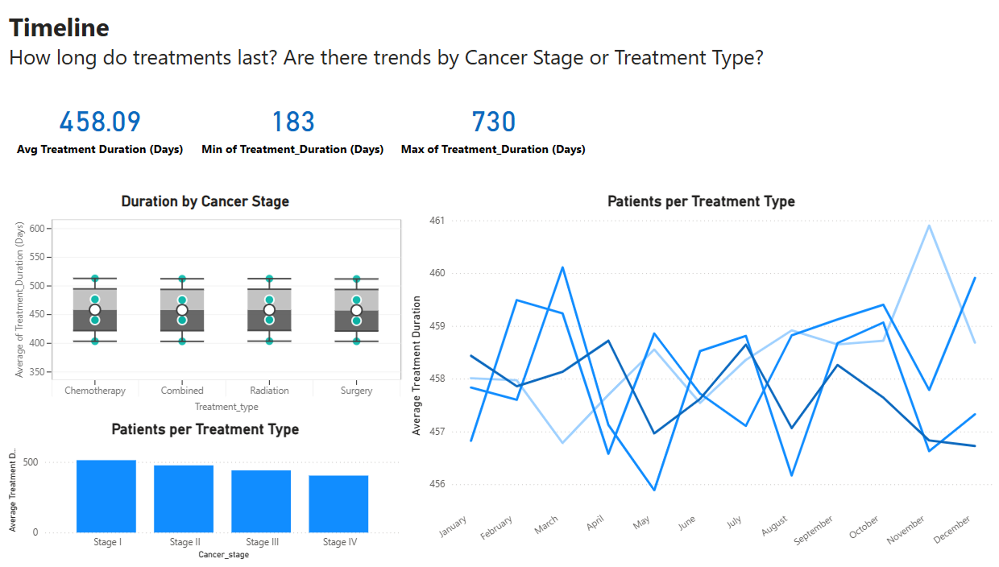

# *AI-Lung-Diagnostics : End-to-End Data Understanding, Exploration, and Cleaning in MySQL*
*This Power BI project explores survival patterns, treatment effectiveness, patient demographics, and treatment timelines among lung cancer patients.*

***Author:*** *Niranjan Kumar*  
***Date:*** *30 June 2025*

---

## *Project Overview*

*This project showcases how raw healthcare data is handled in a real-world industry scenario entirely within a SQL database environment. The focus is on demonstrating the practical steps that data analysts and engineers typically follow to understand, explore, and clean data to make it ready for deeper analysis, reporting, or modeling.*

*The dataset used here represents patient-level information related to lung cancer, including demographic details, medical history, diagnostic timelines, and treatment outcomes. All steps were performed in MySQL Server using standard SQL queries, highlighting how large datasets are commonly managed in production environments where structured storage, consistency, and traceability are critical.*

---

## 📁 1️⃣ Survival Trends

### 🎯 **Business Problem**
What % of patients survived?

### 🖼️ **Dashboard Image**

### 📊 **Observations**
- **Total Patients:** 890K
- **Total Survived:** 196K (22%)
- **Total Not Survived:** 694K (78%)
- **Survival Rate:** 0.22  
- **Non-Survival Rate:** 0.78  
- The donut chart shows a significant imbalance: only about **1 in 5** patients survived.
- The distribution is visually skewed toward non-survivors (red), indicating poor survival outcomes across the dataset.

---

## 📁 2️⃣ Comorbidities & Survival

### 🎯 **Business Problem**
How do conditions like Hypertension, Asthma, Cirrhosis, Other Cancer, and Cholesterol levels affect survival?

### 🖼️ **Dashboard Image**

### 📊 **Observations**
- **Hypertension:**
  - Patients with Hypertension have a higher death count (~0.52M).
  - Survival is much lower among hypertensive patients (~0.15M) compared to non-hypertensive (~0.17M).
- **Asthma:**
  - Both asthmatic and non-asthmatic groups have high death rates, but asthmatics show slightly better survival (~0.09M).
- **Cirrhosis:**
  - Cirrhosis patients mostly did not survive (~0.16M deaths vs 0.04M survived).
- **Other Cancer:**
  - Patients with other cancers show a poor survival rate: ~0.02M survived vs ~0.06M deaths.
  - Those without other cancers: ~0.18M survived vs ~0.63M deaths.
- **Cholesterol Levels:**
  - High cholesterol group has the most deaths (~0.51M).
  - Borderline and high cholesterol patients have fewer survivors compared to deaths.

📌 **Key Insight**: All comorbidities are **negatively associated** with survival — especially **Hypertension** and **Cirrhosis**.

---

## 📁 3️⃣ Treatment Effectiveness

### 🎯 **Business Problem**
Which treatment type gives better survival outcomes?

### 🖼️ **Dashboard Image** 

### 📊 **Observations**
- **Treatment Types**: Chemotherapy, Radiation, Surgery, Combined
- Each treatment type had **roughly 223K patients**.
- Survival per treatment:
  - **Chemotherapy**: ~49K survived, ~174K did not
  - **Radiation**: ~49K survived, ~172K did not
  - **Surgery**: ~49K survived, ~174K did not
  - **Combined**: ~49K survived, ~174K did not
- **Survival rates appear nearly identical** across all treatment types (~22%).
- The donut chart shows equal distribution of patients across all treatments.

📌 **Key Insight**: No treatment type clearly outperforms the others — **survival rates remain consistently low** regardless of treatment type.

---

## 📁 4️⃣ Demographics

### 🎯 **Business Problem**
What is the patient distribution by Gender, Country, and BMI Group?

### 🖼️ **Dashboard Image**

### 📊 **Observations**
- **Gender**:
  - Evenly split: Male ~445K (50.02%), Female ~445K (49.98%)
- **BMI Category**:
  - Most common: **Normal**, followed by Obese Class 3, Obese Class 1, Obese Class 2, Overweight
  - **Underweight** category had the fewest patients
- **Country**:
  - Top contributing countries: Denmark, Netherlands, Spain, Greece, Croatia, Sweden, France, Portugal, Ireland, Malta
  - Each country had around 30K+ patients

📌 **Key Insight**: The dataset shows a **balanced gender distribution**, with higher BMI classes being prevalent and **European countries** being the major contributors to the dataset.

---

## 📁 5️⃣ Timeline

### 🎯 **Business Problem**
How long do treatments last? Are there trends by Cancer Stage or Treatment Type?

### 🖼️ **Dashboard Image**

### 📊 **Observations**
- **Average Treatment Duration**: 458 days
- **Min Duration**: 183 days
- **Max Duration**: 730 days
- **Duration by Cancer Stage**:
  - Stage I: ~530 days
  - Stage II: ~490 days
  - Stage III: ~450 days
  - Stage IV: ~410 days
  - 📉 Duration **decreases with higher stages** (Stage IV patients have shortest durations)
- **Box Plot by Treatment Type**:
  - All treatments had similar median durations (around 50K–60K patients each)
- **Monthly Trends**:
  - Average treatment durations remained stable across months (between 456–461 days)
  - No drastic fluctuations or seasonality observed

📌 **Key Insight**: **Earlier stage patients undergo longer treatment durations**, and treatment timelines remain **consistent across months**, regardless of treatment type.

---

## ✅ Summary

This project offers a full end-to-end analysis of lung cancer survival patterns using interactive dashboards in Power BI. It answers critical business questions around survival trends, comorbidities, treatment impact, demographics, and timelines — making it ideal for healthcare analytics portfolios.

